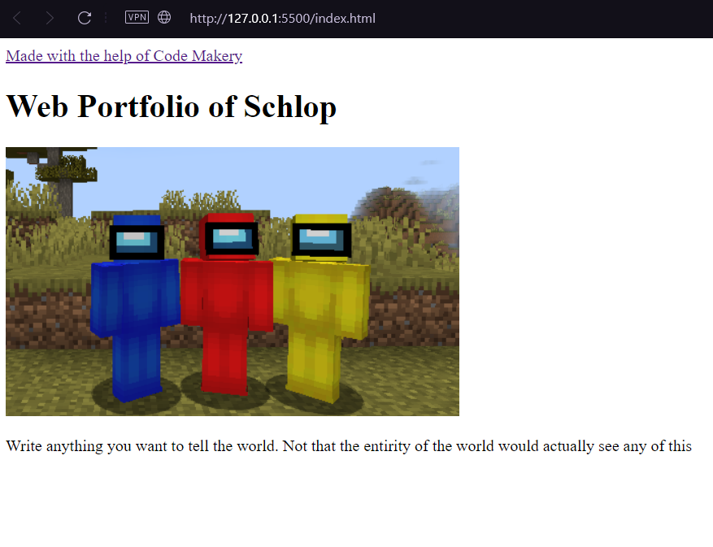
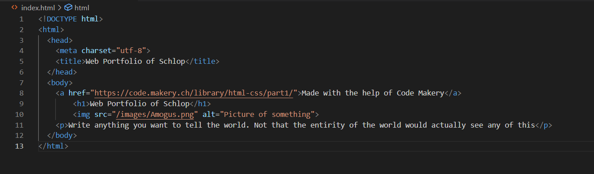

+++
title = "Beginn der Webseite"
date = "2022-10-18"
draft = false
pinned = false
tags = ["Webseite", "HTML", "Programmieren"]
image = "amogus.png"
description = ""
footnotes = "https://code.makery.ch/library/html-css/part1/\n\nhttps://code.visualstudio.com/\n\nhttps://www.opera.com/browsers"
+++
**WEB Unterrichtsbeginn nach den Ferien**

Es ist die erste WEB Lektion nach den Ferien. Wir beginnen zuerst mit einem Stand up in dem jeder erzählt was er in den Ferien gemacht hat. Ich sagte nur wenig und hätte mehr sagen können doch ich wollte mich so kurz fassen wie möglich. 

Wir beginnen nun endlich damit unsere Webseite zu kreieren. Nicht das Endprodukt für unser Projekt aber eine Übungswebseite damit wir uns mit den benötigten Programmiersprachen vertraut machen können. Die benötigten Programmiersprachen sind HTML und CSS. Diese würden wir mithilfe eines online Tutorials erlernen welches auf code.makery.ch zu finden ist.

**Wie macht man eine Webseite?**

Das wichtigste beim erstellen einer Webseite ist es einen Editor zu haben und einen Browser zu haben auf dem man die Webseite ansehen kann. Als Editor benutzte ich Visual Studio Code und mein Browser ist Opera GX.

Wenn man diese 2 Dinge hat muss man als erstes auf den Editor gehen und einen Ordner erstellen bei dem man die Code Dateien ablegen kann. Nachher erstellt man eine index.html Datei und legt diese im Ordner ab. Dank des Online Tutorials waren diese Schritte ziemlich einfach zu erledigen.

Der nächste Schritt ist es die Hauptstruktur der Webseite aufzubauen. Auch dies bereitete mir keine allzu grossen Schwierigkeiten, da ich bereits zuvor Erfahrungen mit HTML gemacht habe weil ich 1 Jahr lang in der Informatikmittelschule war. Das Tutorial half meiner Erinnerung ganz schnell auf die Sprünge und so konnte ich diesen Aufbau schnell und unkompliziert lösen.

Sobald man das getan hat kann man damit anfangen Inhalte in die Webseite zu fügen. Dafür gibt es einige Optionen wie:

1. Bilder
2. Textfelder
3. Videos
4. Links
5. etc

Ich habe als Übung ein paar provisorische Inhalte eingefügt ohne diese speziell zu skalieren oder zu designen.

Alles in allem ist das kreieren einer Webseite gar nicht so schwer, das schwere daran ist es, diese Webseite schlussendlich gut aussehen zu lassen und diese mit links zu verschachteln.

**Fazit des Tages**

Wenn ich die Zeit besser genutzt hätte wäre ich vermutlich viel weiter gekommen doch ich bin trotzdem noch auf einem guten Stand und bin startklar das nächste mal weiterzukommen. Ich freue mich bereits darauf weiter an meiner Webseite zu basteln.